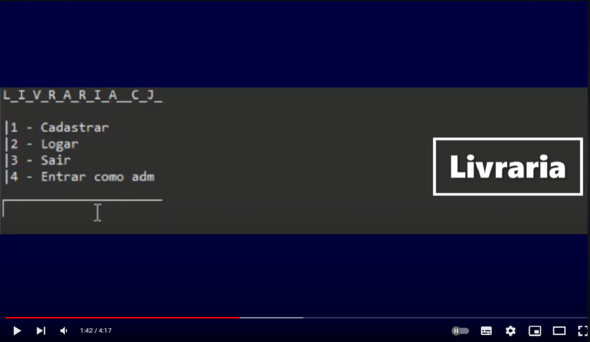

# Projeto-Java
Projeto de livraria em java
Ideia Inicial:
A ideia do projeto foi baseada no conceito de uma livraria que pudesse ofertar opções para o cliente selecionar e comprar livros podendo escolher a opção de compra.
Também o projeto oferece a função administrador da livraria que permite cadastrar novos livros.
Sobre o Projeto:
O Projeto em si consiste na utilização de recursos da linguagem java incluindo a criação de Classes, objetos, métodos e a importação de modulos
como java.util.array.
 
<a href="https://youtu.be/gCP_Ily_L0I">Link do video explicativo no YouTube</a>

